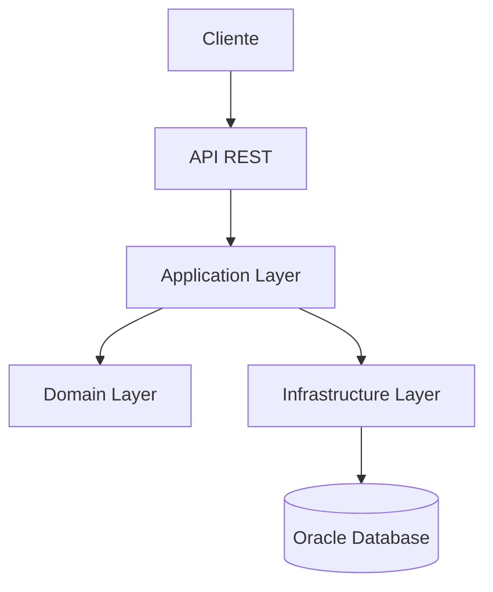
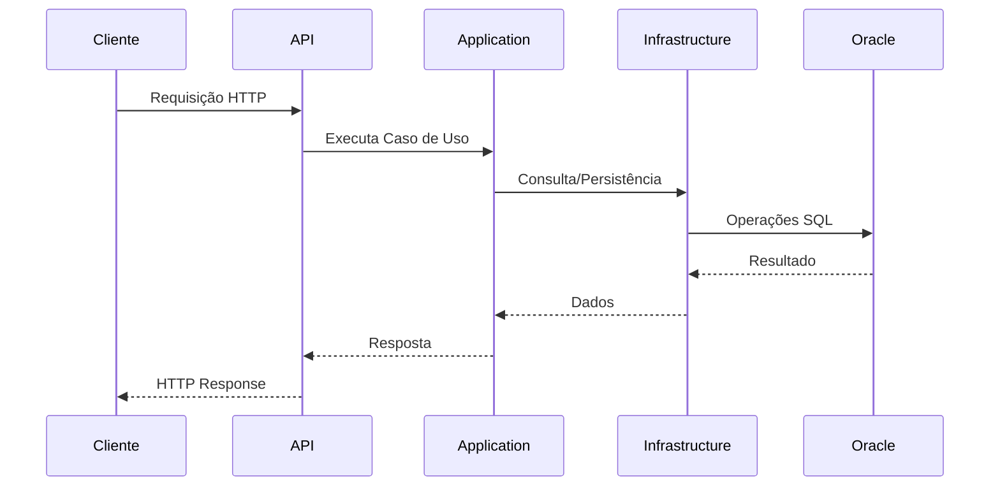
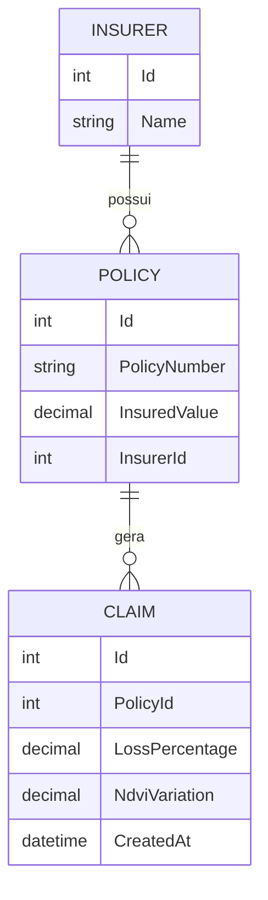

# 🌾 ZenithHarvest

Sistema para gestão de sinistros agrícolas utilizando indicadores de vegetação (NDVI), permitindo que seguradoras realizem análises mais rápidas e precisas sobre perdas causadas por eventos climáticos.

## 🎯 Objetivo

O agronegócio está sujeito a diversos riscos climáticos que podem causar prejuízos significativos aos produtores rurais. O processo tradicional de análise de sinistros costuma ser lento e dependente de vistorias presenciais.

A ZenithHarvest propõe uma solução baseada em tecnologia para auxiliar seguradoras na análise de sinistros agrícolas por meio da integração de informações de vegetação obtidas por satélites, permitindo maior agilidade na tomada de decisão.

---

# 🏗️ Arquitetura da Solução

A aplicação foi desenvolvida seguindo os princípios de **Clean Architecture**, garantindo separação de responsabilidades, facilidade de manutenção e escalabilidade.



## Camadas

### API

Responsável por:

* Exposição dos endpoints REST;
* Autenticação;
* Configuração da aplicação;
* Documentação OpenAPI.

### Application

Responsável por:

* Casos de uso;
* Commands e Queries (CQRS);
* DTOs;
* Regras de aplicação.

### Domain

Responsável por:

* Entidades;
* Interfaces;
* Regras de negócio.

### Infrastructure

Responsável por:

* Persistência de dados;
* Entity Framework Core;
* Repositórios;
* Oracle Database.

---

# 🔄 Fluxo da Aplicação



---

# 🛠️ Desenvolvimento

## Padrões Utilizados

### Clean Architecture

Separação clara entre regras de negócio, infraestrutura e interface de entrada.

### CQRS

Separação entre:

* Commands (escrita)
* Queries (leitura)

### Repository Pattern

Abstração do acesso aos dados.

### Dependency Injection

Gerenciamento de dependências através do container nativo do .NET.

---

# 🗄️ Modelo de Dados

Entidades principais do sistema:



---

# 🚀 Como Executar

## Pré-requisitos

* .NET SDK 10.0
* Docker Desktop
* Git

## Clonar o Projeto

```bash
git clone <URL_DO_REPOSITORIO>
cd zenith-harvest-dotnet
dotnet restore
```

---

## Subir Banco Oracle

```powershell
docker run -d ^
-e ORACLE_PASSWORD=oracle123 ^
-p 1521:1521 ^
--name oracle-db ^
gvenzl/oracle-free:latest
```

Aguardar o Oracle finalizar a inicialização.

```powershell
docker logs -f oracle-db
```

Quando aparecer:

```text
DATABASE IS READY TO USE!
```

---

## Criar Usuário

```powershell
docker exec -it oracle-db sqlplus sys/oracle123@localhost:1521/freepdb1 as sysdba
```

```sql
ALTER SESSION SET CONTAINER=FREEPDB1;

CREATE USER zenith_user IDENTIFIED BY zenith123;

GRANT CONNECT, RESOURCE, UNLIMITED TABLESPACE TO zenith_user;

COMMIT;
EXIT;
```

---

## Executar Migrations

```powershell
dotnet ef database update --project src/ZenithHarvest.Infrastructure
```

---

## Executar Aplicação

```powershell
dotnet run --project src/ZenithHarvest.Api --launch-profile https
```

Saída esperada:

```text
Now listening on: https://localhost:7177
```

---

## Documentação da API

Acesse:

```text
https://localhost:7177/scalar/v1
```

---

# 📚 Endpoints

## Autenticação

### Login

```http
POST /api/Auth/login
```

Retorna um token JWT para autenticação.

---

## Apólices

### Listar Apólices

```http
GET /api/Policies/{insurerId}
```

### Criar Sinistro

```http
POST /api/Policies/claims
```

---

## Health Check

```http
GET /health
```

---

# 🔐 Segurança

O sistema utiliza:

* JWT Authentication;
* Autorização baseada em token;
* Tratamento global de exceções;
* Validação de entrada de dados;
* Health Checks.

---

# 🧪 Testes

## Executar Testes

```bash
dotnet test tests/ZenithHarvest.Tests
```

## Cobertura de Código

```bash
dotnet test tests/ZenithHarvest.Tests --collect:"XPlat Code Coverage"
```

## Escopo dos Testes

### Testes Unitários

Validação de:

* Casos de uso;
* Regras de negócio;
* Handlers;
* Autenticação.

### Testes de Integração

Validação de:

* Persistência Oracle;
* Endpoints REST;
* Fluxo da aplicação;
* Health Checks.

---

# 📋 Exemplos de Uso

## Login

```bash
curl -X POST https://localhost:7177/api/Auth/login \
-H "Content-Type: application/json" \
-d '{"email":"teste@seguros.com","senha":"senha123"}'
```

Resposta:

```json
{
  "token": "jwt-token"
}
```

---

## Consultar Apólices

```bash
curl -X GET https://localhost:7177/api/Policies/1 \
-H "Authorization: Bearer SEU_TOKEN"
```

---

# 📸 Evidências

## Documentação OpenAPI

> Inserir captura de tela da documentação Scalar.

## Execução da API

> Inserir captura de tela da aplicação em execução.

## Banco Oracle

> Inserir captura de tela do container Oracle.

## Testes Automatizados

> Inserir captura de tela da execução dos testes.

---

# 🎥 Vídeos

## Demonstração da Solução (até 8 minutos)

Link:

```text
[Adicionar link do vídeo]
```

Conteúdo apresentado:

* Arquitetura;
* Banco Oracle;
* Execução da aplicação;
* Login;
* JWT;
* Endpoints;
* Testes.

---

## Pitch (até 3 minutos)

Link:

```text
[Adicionar link do vídeo]
```

Conteúdo apresentado:

* Problema;
* Solução;
* Diferenciais;
* Tecnologias;
* Benefícios para seguradoras.

---

# 📂 Estrutura do Projeto

```text
zenith-harvest-dotnet
│
├── src
│   ├── ZenithHarvest.Api
│   ├── ZenithHarvest.Application
│   ├── ZenithHarvest.Domain
│   └── ZenithHarvest.Infrastructure
│
├── tests
│   └── ZenithHarvest.Tests
│
└── README.md
```

---

# 🔧 Tecnologias Utilizadas

| Tecnologia               | Finalidade           |
| ------------------------ | -------------------- |
| .NET 10                  | Plataforma principal |
| ASP.NET Core             | API REST             |
| Entity Framework Core    | ORM                  |
| Oracle Database 21c Free | Banco de Dados       |
| JWT                      | Autenticação         |
| xUnit                    | Testes               |
| Docker                   | Containerização      |
| Scalar/OpenAPI           | Documentação         |

---

# ✅ Funcionalidades Implementadas

* ✅ Clean Architecture
* ✅ CQRS
* ✅ Repository Pattern
* ✅ Oracle Database
* ✅ Entity Framework Core
* ✅ JWT Authentication
* ✅ OpenAPI/Scalar
* ✅ Health Checks
* ✅ Migrations
* ✅ Testes Automatizados
* ✅ Tratamento Global de Exceções

---

# 📄 Licença

Projeto desenvolvido para fins acadêmicos e demonstrativos.

---

Esse README atende muito melhor aos requisitos de **diagramas**, **desenvolvimento**, **testes**, **instruções de acesso** e **exemplos de uso** que normalmente aparecem em desafios da FIAP/Global Solution e processos seletivos.
